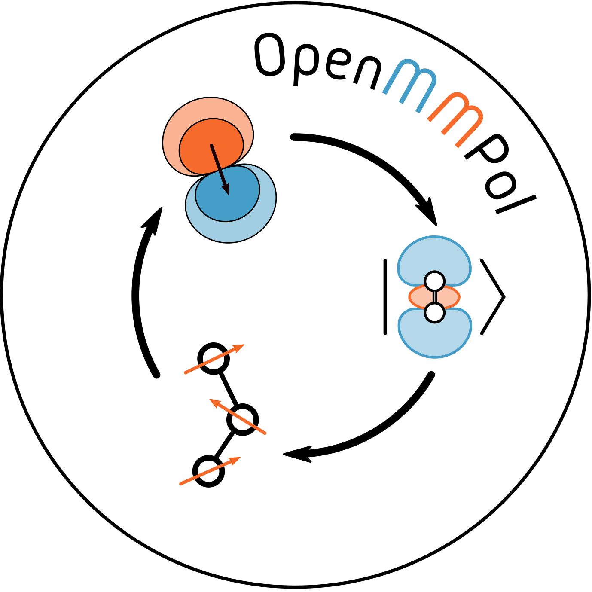

# Open-MMPol
{width=100 height=100px}

## Description

Ope-MMPol is an open-source library to interface quantum chemical software with 
atomistic polarizable embedding. 
It allows to compute all the electrostatic quantities needed for a polarizable embeddings with 
AMOEBA (and other forcefield) of virtually any 
quantum mechanical method that is able to provide electrostatic potential, field and field gradients 
for a given density. In particular through simple interface function it allows to compute 
the contribution to the energy and to the Fock matrix. 

OpenMMPol also implemnts non-electrostatic parts of MM forcefield (Van der Waals terms, bonded 
interactions etc.) in order to enable the host code to compute the full potential for the 
embedded system.

OpenMMPol is distributed with interfaces to C, Fortran and Python3. 

OpenMMPol is written and mantained by the MoLECoLab (Modeling Light & Environment in Complex Systems) 
research group at the University of Pisa. 

## Documentation
Documentation is generated with [FORD](https://github.com/Fortran-FOSS-Programmers/ford) and is 
available at [project documentation page](https://github.com/Molecolab-Pisa/...)

## License 
OpenMMPol is free software, you can use it under the terms of the LGPL-3.0 License.

## Dependencies and Quick Installation

To build and install the package, you just need a compiler that supports standard Fortran2008ts (currently the 
library is tested with `gnu 7.5.0`, `intel 2021.7.0` and `nvidia 10.2.89`), cmake >= 3.20, 
lapack libraries and optionally hdf5 library. 

To install the requirements on OpenSuse Leap just use the following command:

``zypper in gcc gcc-c++ gcc-fortran make cmake python lapack-devel liblapack3 hdf5 hdf5-devel zlib-devel``

To build the package, just use cmake in the standard way; from the root directory of the git repository:

``$ mkdir build``
  
``$ cd build``
  
``$ cmake -DCMAKE_BUILD_TYPE=DEBUG .. # You can use DEBUG or RELEASE to control the build flags``
  
To compile with intel compilers use:

``$ cmake -DCMAKE_C_COMPILER=icx -DCMAKE_CXX_COMPILER=icpx -DCMAKE_BUILD_TYPE=DEBUG ..``

To compile with nvidia compilers use:

``$ cmake -DCMAKE_C_COMPILER=nvc -DCMAKE_CXX_COMPILER=nvcc -DCMAKE_BUILD_TYPE=DEBUG ..``

``$ make``

To install the library just use:

``$ make install``

To compile the python module you need the pybind11 package and numpy; to install those
requirements on  OpenSuse Leap use:

``zypper in python-pybind11-common-devel python3-numpy python3-pybind11 python3-pybind11-devel``

To compile and install the python packge, from the root of repository, just use:

``pip install .`` 
